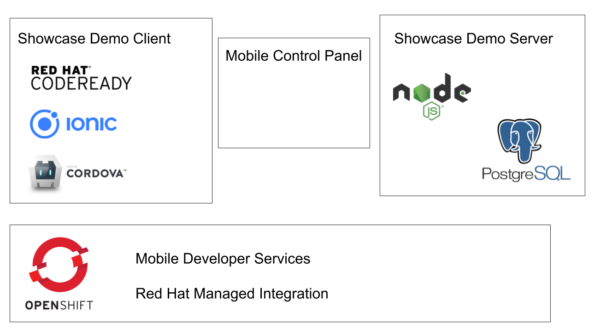

:showcase-app-link: https://github.com/aerogear/ionic-showcase

= Building secure, data first mobile app solutions with Mobile Developer Services 

:context: mobile-developer-services

Mobile Developer Services provids a suite of Mobile Services across a range of native and hybrid client SDKs 
that will simplify your mobile and modern application development needs, leveraging OpenShift's Container technology to provide a secure, scalable backend platform.

In this walkthrough we are going to focus on the process of deploying `ionic-showcase` demo application that is utilizing all available Mobile Developer Services 
in form of Node.js based server docker image and docker container with Progressive Web Application that can be launched in browser or mobile device. 
Additionally we going to explore `Mobile Developer Console` that is going to help us to orchiestrate all services and obtain mobile client configuration.

Our demo showcase application will consist of:

- Node.js server side application that will be deployed to OpenShift user namespace.
Server side implements example TODO GraphQL API and connects to Postgress 

- Ionic Framework and Apache Cordova client side application that we going to launch in CodeReady workspace

As part of this walkthrough we going to utilize following Mobile Developer Services:

- Data Sync Framework 
Adds realtime data synchronization and offline capabilities to your mobile app

- Identity Management 
Adds authentication and authorization to your mobile app

- Mobile Metrics
Gather metrics on mobile apps, device versions, device security checks and back-end mobile service usage

[type=walkthroughResource, serviceName=openshift]
.OpenShift Project
****
* link:{openshift-host}/console/project/{walkthrough-namespace}/overview[OpenShift Project, window="_blank"]
****

[type=walkthroughResource]
.Mobile Developer Console
****
* link:{route-mdc-server-host}[Mobile Developer Console, window="_blank"]
****

[type=walkthroughResource]
.Mobile Developer Services Documentation
****
* link:https://access.redhat.com/documentation/en-us/red_hat_mobile_developer_services/1[Documentation, window="_blank"]
****

[type=walkthroughResource,serviceName=codeready]
.CodeReady Workspaces
****
* link:https://developers.redhat.com/products/codeready-workspaces/overview/[Overview, window="_blank"]
* link:https://access.redhat.com/documentation/en-us/red_hat_codeready_workspaces_for_openshift/1.0.0/[Documentation, window="_blank"]
****

[type=walkthroughResource,serviceName=openshift]
.Red Hat OpenShift
****
* link:{openshift-host}/console[Console, window="_blank"]
* link:https://help.openshift.com/[Openshift Online Help Center, window="_blank"]
* link:https://blog.openshift.com/[Openshift Blog, window="_blank"]
****

// NOTES: Till all services will be avaiable as operators inside openshift cluster we will require additional installation steps
// Developers need to provision all services using Tech Preview. 
// To do that please follow README in https://github.com/aerogear/mobile-services-installer

[time=20]
== Create DataSync Showcase Server Application from OpenShift template

DataSync framework is an set of libaries that will allow developers to easily create mobile apps that can sync data to the their backend. The DataSync libaries are based on the popular Apollo GraphQL server, with the following additional functionalities:

. Offline Support
. Conflict Resolution
. Easy integration with other mobile services

This section describes how to deploy the example DataSync server in an Integreatly cluster from the OpenShift Service Catalog.

* Create a new project or namespace in the OpenShift Web Console
* Add DataSync template by executing:
`oc create -f https://raw.githubusercontent.com/aerogear/datasync-deployment/master/openshift/datasync-showcase.yml`
* In the new project use the 'Search Catalog' bar to search for 'Data
Sync Showcase'
* The form is already prefilled with all of the necessary values.
* The only field you might want to change is
`+AMQ Messaging User Password+`.
** The default value is `+Password1+` in base64 encoding
** The value _must_ be base64 encoded
** A custom value can be created in the terminal using
`+$ echo <password> | base64+`
* When the create button is clicked, a warning message may be displayed

The hostname for the AMQ Online Broker, (needed by demo sever) is only made available after the resources from the the template have been provisioned. One more step is needed to update the ionic-showcase-server deployment with the correct
`+MQTT_HOST+` environment variable.

* From the terminal, ensure you have the correct namespace selected.

....
oc project <project where template was provisioned>
....

* Update the ionic-showcase-server deployment to add the `+MQTT_HOST+`
variable.

....
oc set env dc/ionic-showcase-server MQTT_HOST="$(oc get addressspace showcase -o jsonpath='{.status.endpointStatuses[?(@.name=="messaging")].serviceHost}')"
....

At this point, the showcae server is provisioned and the logs from the
ionic-showcase-server pod will include the output
`+connected to messaging service+`.

. Try out the link:{route-sync-app-syncserver-host}/graphql[GraphQL playground, window="_blank"].
. Paste in the following query/mutation into the text edit:
+
.Sample GraphQL Queries
----
query listTasks {
  allTasks {
    title,
    description,
    id
  }
}

mutation createTask {
  createTask(title: "complete the walkthrough", description: "complete the mobile walk through") {
    title,
    description,
    version,
    id
  }
}
----
+
and try execute them. Feel free to explore the schema and add more queries and mutations.

[time=5]
== Create Mobile Application in Mobile Developer Console

The Mobile Developer Console is where mobile developers can view avaiable mobile services, bind them to their mobile apps and get the configurations for the bound mobile services. Developer Console is already available in cluster and accessible under following url: 

link:{route-mdc-server-host}[Mobile Developer Console, window="_blank"]

=== Steps

. Go to link:{route-mdc-server-host}[Mobile Developer Console, window="_blank"], and you can login with your OpenShift credential.
MDC panel will allow us to create new Mobile Applications and connect (bind) them with all available Mobile Developer services
. Click on the `Create Mobile App` button to create a new app. 
. Put any name for the mobile application. For example `demo`.
. When the app is created, click on it and it will bring you to the configure page. On the left hand side, 
  you will see Wathe instructions to add the SDKs to your client app. On the right hand side you will see the content of the configuration file to add to a client app. There should be no services listed in the configuration file.
. Go to the `Mobile Services` tab, and you should see there are a few services listed in the `Unbound Services` section.
. Bind the `Mobile Metrics` and `Identity Management` services to the app by clicking on the "Bind To App" buttons. Use the default binding options, and once the bindings are completed, you will see them in the `Bound Services` section. 
. Now go back to the `Configuration` tab again, you will see the `mobile-services.json` file is updated with information about the bound services. If you expand the row for each service, you will see the links to each of the service. Feel free to click on the links and explore the dashboard for each of the service.
. Copy `mobile-services.json`

[time=2]
== Apply Showcase URL to configuration

Temporary until we figure out how to do it

`mobile-services.json`

=== Steps

. Edit `mobile-services.json` and add another service

------
{
      "id": "sync",
      "name": "sync",
      "type": "sync",
      "url": "{showcase route url}",
      "config": {}
}
------

[time=10]
== Run the DataSync client PWA application in CodeReady workspace

In the previous task, we deployed the sync backend server, now let's run the sync client app and connect it to the backend.

=== Steps

- TODO how to access code ready?
- Login to CodeReady, and you don’t need to create a workspace.
- Modify the url to something like this:
https://<codeready-host>/f?url=https://github.com/aerogear/ionic-showcase.git
CodeReady will automatically set up a new workspace for you.
- Next, you should be able to find a few prede-fined commands in the “Manage Commands” panel. Run the `build` command to install required dependencies, and then `serve` command to allow preview the app. When you run the `servce` command, it will print out a url in the console for preview.
- Replace `mobile-services.json` created in previous steps located in `src/mobile-services.json`
- Execute `serve` command
- Showcase client should be running in your console and be ready to be used in your local browser and phone

[time=10]
== Run application on your browser/phone

TODO. 
We might add QR code to showcase for people to scan it in order to 
get url. Retyping URL to phone will be quite bad experience.

[time=10]
== DataSync Offline and Conflict resolution functionalities

To demo data sync functionalities, it’s best to run at least 2 instances of the showcase client app: 
perhaps one in a normal browser tab, and one in the incognito/private tab. 
Google Chrome is the recommended web browser for this. 

=== Steps

- Use the “Manage Tasks” page in the showcase client app.
- Try create one task in one device, and it should show up immediately in another.
- Try bring one client offline (you can use the Network tab from Chrome Developer Tools to simulate offline mode - open them using F12, or using Command+Option+I on macOS), perform some actions, bring it online and you should see the changes synced to another app straight away.
- To create conflicts, try bringing both clients offline, and modify the same item. The last instance of app that is online will receive conflicts.

[time=10]
== [Optional] Check the audit logs

You can use the OpenShift logging feature to see the audit logs that are generated by the syncserver app.

=== Steps

. Find out the URL of the Kibana dashboard of your OpenShift cluster:
.. Run the following commands on the bastion server (as root user):
+
----
oc project openshift-logging
oc get route
----
+
.. You should see there is a route called `logging-kibana`. Copy the `Host` value of that route and open it in your browser. You should see the Kibana dashboard page.
. Filter out the audit log messages in Kibana. 
.. On the `Discover` page, there should be a dropdown you can select on this page. Choose the namespace where the syncserver app is deployed to, and take a look at the messages.
.. You should see a lot of messages, try expand one and see what the message looks like.
.. In the `Search` field on the top, enter `tag:AUDIT` and you should be able to see the audit logs generated by the app. If you can't see any message, go to the GraphqQL playground page and execute some queries and then try search again.
.. [Optional] Follow the steps descibed in link:https://github.com/aerogear/apollo-voyager-server/blob/master/doc/guides/metrics-and-audit-logs.md#importing-kibana-saved-objects:[Importing Kibana Saved Objects guide] and try importing a dashboard template for the sync app, and view the imported dashboard.

[time=15]
== [Optional] Protect the sync app by Keycloak

The sync server app is not protected at the moment, let's bind it with Keycloak and protect the endpoints.

=== Steps

. Go to the link:{openshift-host}/console/project/{walkthrough-namespace}/overview[OpenShift conosle, window="_blank"], find `Identity Management` in the "Provisioned Services" section, and click on "Create Binding".
. Use the following configurations for the binding parameters:
.. Mobile client ID/Service ID: `syncserver`
.. Keycloak client type: `bearer`
. Once the binding is created, we can mount the secret that is being created to the sync app: 
.. Click on the `View Secret` link of the created binding
.. In the secret's view, click on `Add To Application`
.. Select `sync-app-syncserver` as the target application
.. Add secret as `Volume` and set the mount path to `/tmp/keycloak`
. Update the `sync-app-syncserver` to use the mounted secret:
.. Go to the link:{openshift-host}/console/project/{walkthrough-namespace}/browse/dc/sync-app-syncserver?tab=environment[Environment view] of the sync server deployment config, and add the following new environment variables and save.
.. Name: `KEYCLOAK_CONFIG`, Value: `/tmp/keycloak/config`
.. Name: `NODE_TLS_REJECT_UNAUTHORIZED`, Value: `0`
. Wait for the sync server to be redeployed and starts up.
. Now to go the link:{route-sync-app-syncserver-host}/graphql[GraphQL playground, window="_blank"] we have opened previously and refresh the page. This time you should get an `Access Denied` error. This is because the endpoint is now protected by Keycloak and requires user authentication. Let's add authentication to the client app.
. Go to link:{route-mdc-server-host}[Mobile Developer Console, window="_blank"] and bind the `todoapp` to the `Identity Management` service. This time select `public` as the client type. When the binding is completed, you should see the `mobile-services.json` file is updated. Copy the content of the file.
. Edit the `src/mobile-services.js` file in the client app, and paste in the new content. Build it and run it again. When you start it, you will be redirected to a login page. However, we don't have any users created yet, so let's do that:
.. link:{openshift-host}/console/project/{walkthrough-namespace}/overview[OpenShift conosle, window="_blank"], find the url for Keycloak and open it. On the landing page, go to the `Administration Console` and login as the admin user (you can use `admin/admin` as the username and password).
.. Select `Users` on the left menu, and click on `View all users`. You will see there are no users in this realm. Click on `Add user` to create new ones. Pick a username you like and save.
.. Go to `Credentials` tab and set a password for the user. Set `Temporary` option to `OFF`.
. Now the user is created, you can use this user to login from the client app. Try it and you should be able to view the tasks that are created previously, and create new ones again.
. Go to link:{route-grafana-host}[Grafana dashboard, window="_blank"] to view the metrics dashboard.